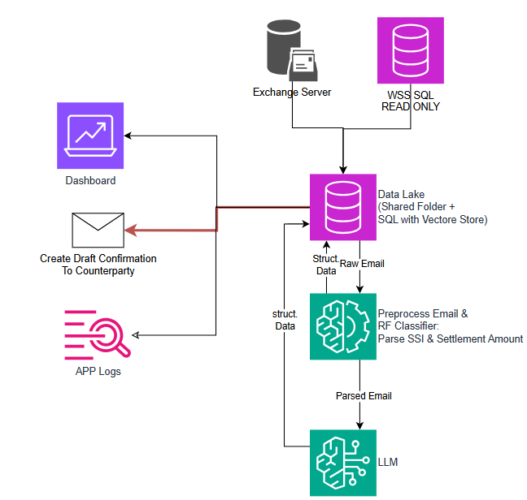

# Confirmation Matching Testing

Financial trade confirmation processing pipeline with SQLite-backed storage and field-level LLM normalization.



## What Changed

- Moved to a DB-first parsing flow for confirmation fields.
- Added `confirmation_data` table with raw columns and matching `*_LLM` columns.
- Refactored parser to process only new/unprocessed values.
- Split LLM metadata into a dedicated module:
  - shared general system prompt
  - field-specific instructions
  - per-field few-shot examples
  - per-field JSON schema

## Current Architecture

1. Raw data is inserted into `DB/confirmation.db` table `confirmation_data`.
2. `confirmation_parser.py` scans rows in `confirmation_data`.
3. For each field (`currency`, `settlement_amount`, `buy_sell`, `isin`, `settlement_date`, `SSI`):
   - if raw value exists
   - and corresponding `*_LLM` value is empty
   - parser makes one LLM call for that field only.
4. Parsed output is written back to the matching `*_LLM` column.

## Database

Script: `create_confirmation_table.py`

Creates table `confirmation_data` in `DB/confirmation.db` with:

- `currency`, `currency_LLM`
- `settlement_amount`, `settlement_amount_LLM`
- `buy_sell`, `buy_sell_LLM`
- `isin`, `isin_LLM`
- `settlement_date`, `settlement_date_LLM`
- `SSI`, `SSI_LLM`
- `creation_date`, `creation_date_LLM`

`creation_date` defaults to `CURRENT_TIMESTAMP`.

## LLM Metadata Design

File: `llm_metadata.py`

- `GENERAL_SYSTEM_PROMPT`: shared rules used by all fields.
- `FieldLLMMetadata`: metadata model for one source field.
- `FIELD_LLM_METADATA`: mapping from source field to:
  - source column
  - destination LLM column
  - output key
  - few-shot examples
  - composed system prompt (general + field rules)
  - format schema

This keeps prompt/schema logic out of parser code.

## Parser Behavior

File: `confirmation_parser.py`

- Reads from `confirmation_data`.
- Uses `FIELD_LLM_METADATA` for prompt/schema routing.
- Processes one field at a time per row.
- Skips already-processed `*_LLM` values.
- Updates only pending fields.

Run:

```bash
python confirmation_parser.py
```

## Other Scripts

- `pdf_to_text.py`: extract text from PDFs into `External_Data/dummy/*.txt`
- `json_to_sqlite.py`: legacy JSON ingestion into `Counterparty_Data` table
- `wss_loader.py`: load `WSS_Data.xlsx` into `wss_data` table

## Setup

### Requirements

- Python 3.12+
- Ollama
- Model: `llama3.2:latest`

Install dependencies:

```bash
pip install -r requirements.txt
```

Start Ollama and pull model:

```bash
ollama serve
ollama pull llama3.2
```

## Recommended Run Order

1. Create table:

```bash
python create_confirmation_table.py
```

2. Insert raw values into `confirmation_data` (manual or your loader).
3. Run parser:

```bash
python confirmation_parser.py
```

4. Query results from `*_LLM` columns in `DB/confirmation.db`.
